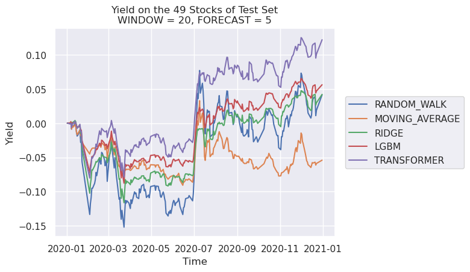
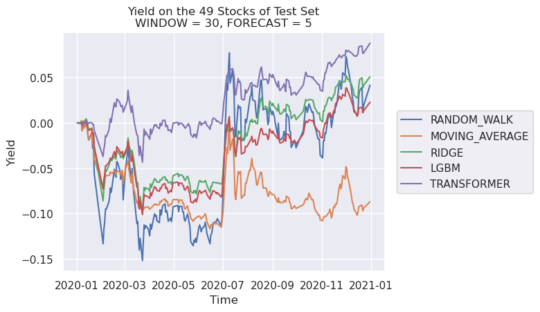

# Research of Stock Price Trend Prediction Based on Machine Learning Models
Peking University Undergraduate Thesis

Model investigated:
- Transformer

Baselines:

- Random walk
- Moving average
- Ridge
- LightGBM

Dataset: 49 stocks of SSE50 index of the Shanghai Stock Exchange from 2013-01-04 to 2020-12-31

